# Projects in Mad-Pascal

## 1. StarVagrant

> _New trading game in space for the ATARI XL/XE computer._

<a href="images/01.png">
  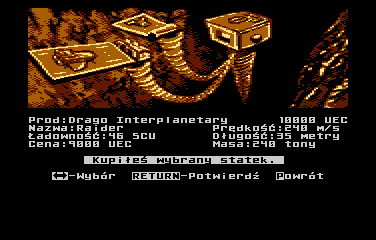
</a>

**Repository**  
https://github.com/MADRAFi/StarVagrant

**Platform**  
Atari 8-bit

**Author**  
Rafał Czemko
 

---

## 2. Mad Kingdom (Vox Regis)

> _Zarządzaj dumnie swym królestwem! Dokonuj tylko mądrych wyborów._

<a href="images/02.png">
  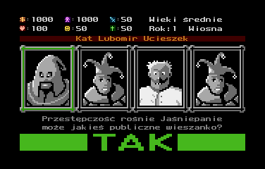
</a>

[https://gitlab.com/bocianu/MadKingdom](https://gitlab.com/bocianu/MadKingdom)

**Platform**  
Atari 8-bit

**Author**  
Wojciech Bociański
 

---

## 3. ZILCH

<a href="images/03.png">
  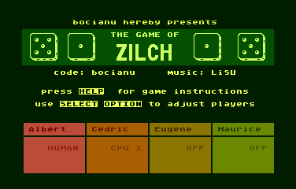
</a>

[https://gitlab.com/bocianu/zilch](https://gitlab.com/bocianu/zilch)

**Platform**  
Atari 8-bit

**Author**  
Wojciech Bociański
 

---

## 4. Just Pong!

<a href="images/04.png">
  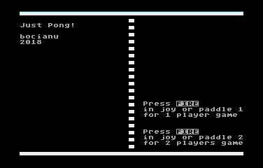
</a>

[https://gitlab.com/bocianu/justpong](https://gitlab.com/bocianu/justpong)

**Platform**  
Atari 8-bit

**Author**  
Wojciech Bociański
 

---

## 5. Hoppe

<a href="images/05.png">
  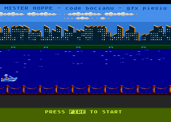
</a>

[https://gitlab.com/bocianu/hoppe](https://gitlab.com/bocianu/hoppe)

**Platform**  
Atari 8-bit

**Author**  
Wojciech Bociański
 

---

## 6. Betty's Issues

<a href="images/06.png">
  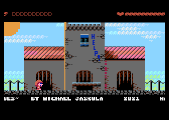
</a>

[https://www.mikej.de/game21.php](https://www.mikej.de/game21.php)

**Platform**  
Atari 8-bit

**Author**  
Michael Jaskula
 

---

## 7. PacMad

<a href="images/07.png">
  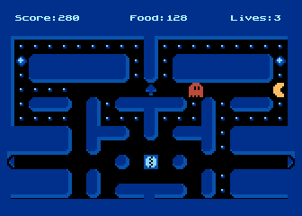
</a>

[https://gitlab.com/bocianu/PacMad](https://gitlab.com/bocianu/PacMad)

**Platform**  
Atari 8-bit

**Author**  
Wojciech Bociański
 

---

## 8. neo-PacMad

[https://gitlab.com/bocianu/neo-pacmad](https://gitlab.com/bocianu/neo-pacmad)

**Platform**  
neo6502

**Author**  
Wojciech Bociański
 

---

## 9. K12: The Golden Ticket - teaser

<a href="images/09.png">
  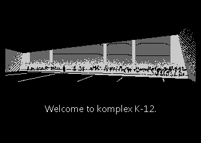
</a>

[https://gitlab.com/bocianu/k12trailer](https://gitlab.com/bocianu/k12trailer)

**Platform**  
Atari 8-bit  
Compy Shop 256K

**Author**  
Wojciech Bociański 

---

## 10. gr10

> _Graphics 10 mode ++ (GTIA) library_

[https://gitlab.com/bocianu/gr10](https://gitlab.com/bocianu/gr10)

**Platform**  
Atari 8-bit

**Author**  
Wojciech Bociański
 

---

## 11. Old Mansion

> _"Old mansion" is a simple turn-based, rogue-like (adventure) game where
we control actions of a hero that has found himself in an old/haunted mansion,
and he has to traverse the rooms to reach the exit._

<a href="images/11.png">
  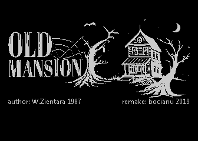
</a>

[https://gitlab.com/bocianu/oldmansion](https://gitlab.com/bocianu/oldmansion)

**Platform**  
Atari 8-bit

**Author**  
Wojciech Bociański

 

---

## 12. Old Mansion X16

<a href="images/12.png">
  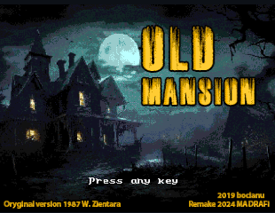
</a>

[https://github.com/MADRAFi/OldMansion](https://github.com/MADRAFi/OldMansion)

**Platform**  
X16

**Author**  
Rafał Czemko

 

---

## 13. Old Mansion C64

[https://gitlab.com/t-m/old_mansion_c64](https://gitlab.com/t-m/old_mansion_c64)

**Platform**  
C64

**Author**  
Tomasz Wolak 

---

## 14. ARTur

<a href="images/14.png">
  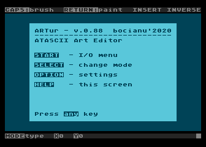
</a>

[https://gitlab.com/bocianu/artur](https://gitlab.com/bocianu/artur)

**Platform**  
Atari 8-bit

**Author**  
Wojciech Bociański

 

---

## 15. Jaskinia City Quest

<a href="images/15.png">
  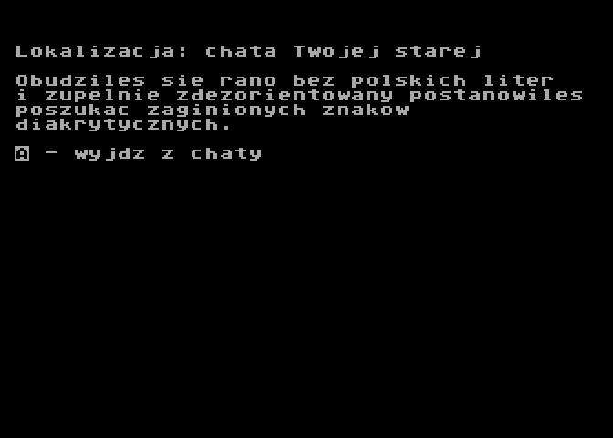
</a>

[https://gitlab.com/bocianu/jcq](https://gitlab.com/bocianu/jcq)

**Platform**  
Atari 8-bit

**Author**  
Wojciech Bociański

 

---

## 16. Fujinet UDP shoutbox

[https://gitlab.com/bocianu/fujinet-udp-shoutbox](https://gitlab.com/bocianu/fujinet-udp-shoutbox)

**Platform**  
Atari 8-bit  
FujiNet  

**Author**  
Wojciech Bociański 

---

## 17. Fujitalk-client

> _FujiTalk is a chat client for 8-bit atari computers equipped with FujiNet interface.
It is similar to IRC clients, but much simplier._

[https://gitlab.com/bocianu/fujitalk-client](https://gitlab.com/bocianu/fujitalk-client)

**Platform**  
Atari 8-bit  
FujiNet  

**Author**  
Wojciech Bociański 

---

## 18. Speedway

> _Simple Atari 8-bit racing game._

<a href="images/18.png">
  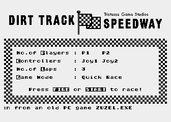
</a>

[https://gitlab.com/bocianu/speedway](https://gitlab.com/bocianu/speedway)

**Platform**  
Atari 8-bit

**Author**  
Wojciech Bociański

 

---

## 19. chessNet

> _Klient serwera FICS pozwalający na grę w szachy przez internet._

[https://gitlab.com/bocianu/chessnet](https://gitlab.com/bocianu/chessnet)

**Platform**  
Atari 8-bit  
FujiNet  

**Author**  
Wojciech Bociański 

---

## 20. gr9Lab

> _gr9Lab is an application designed for image processing on 8-bit Atari computer._

<a href="images/20.png">
  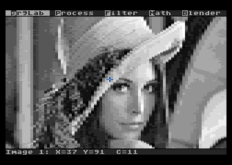
</a>

[https://gitlab.com/amarok8bit/gr9Lab](https://gitlab.com/amarok8bit/gr9Lab)

**Platform**  
Atari 8-bit

**Author**  
Krzysztof Piotrowski

 

---

## 21. SortViz

> _SortViz is an application which visualizes variety of sorting algorithms on Atari 8-bit computer._

<a href="images/21.png">
  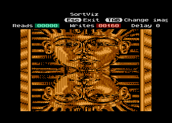
</a>

[https://gitlab.com/amarok8bit/sortviz](https://gitlab.com/amarok8bit/sortviz)

**Platform**  
Atari 8-bit

**Author**  
Krzysztof Piotrowski

 

---

## 22. weather

> _Connects to OpenWeatherMap to get current conditions and an 8-day forecast._

[https://gitlab.com/bocianu/weather](https://gitlab.com/bocianu/weather)

**Platform**  
Atari 8-bit  
FujiNet  

**Author**  
Wojciech Bociański 

---

## 23. cart builder

> _Simple toolchain for building Atari MaxFlash cartridge images._

[https://gitlab.com/bocianu/cart_builder](https://gitlab.com/bocianu/cart_builder)

**Platform**  
Atari 8-bit

**Author**  
Wojciech Bociański 

---

## 24. Mole

> _Port of the game KRET from PC to Atari 8-bit. Arcade and logic game._

<a href="images/24.png">
  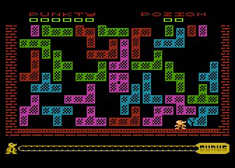
</a>

[https://github.com/GSoftwareDevelopment/Mole](https://github.com/GSoftwareDevelopment/Mole)

**Platform**  
Atari 8-bit

**Author**  
Paweł Banaś

 

---

## 25. SFX-Tracker

> _Music Maker for ATARI 8-bit computers._

<a href="images/25.png">
  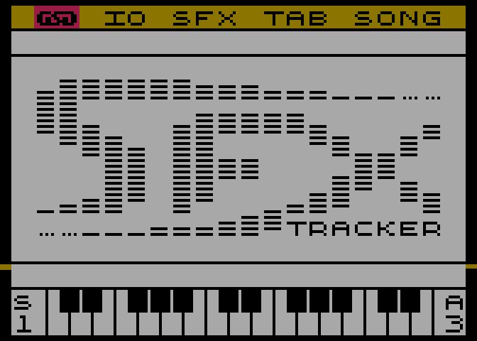
</a>

[https://github.com/GSoftwareDevelopment/SFX-Tracker](https://github.com/GSoftwareDevelopment/SFX-Tracker)

**Platform**  
Atari 8-bit

**Author**  
Paweł Banaś

 

---

## 26. SFX-Engine

> _Autorski silnik muzyczny dla 8-bitowego ATARI, pozwalający odtwarzać pliki muzyczne zapisane w programie SFX Music Maker (aka SFX-Tracker)._

[https://github.com/GSoftwareDevelopment/SFX-Engine](https://github.com/GSoftwareDevelopment/SFX-Engine)

**Platform**  
Atari 8-bit

**Author**  
Paweł Banaś 

---

## 27. SFX-Engine-example

[https://github.com/GSoftwareDevelopment/SFX-Engine-example](https://github.com/GSoftwareDevelopment/SFX-Engine-example)

**Platform**  
Atari 8-bit

**Author**  
Paweł Banaś 

---

## 28. MIDICar-Player

> _MIDI file player designed for the ATARI 8-bit platform. It uses the MIDICar interface plugged in as an external device, via the ECI/CARD bus (XE series) or the PBI bus (XL series)._

[https://github.com/GSoftwareDevelopment/MIDICar-Player](https://github.com/GSoftwareDevelopment/MIDICar-Player)

**Platform**  
Atari 8-bit

**Author**  
Paweł Banaś 

---

## 29. Heatmap

> _I was inspired by Thom's posts on one of the retrocomputing groups on the engineering use of computers, where he showed how data analysis could be solved using a heatmap._

<a href="images/29.png">
  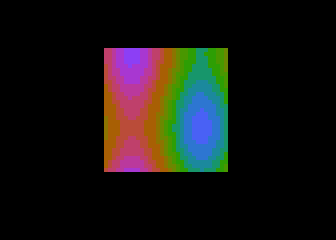
</a>

[https://gitlab.com/delysio/heatmap](https://gitlab.com/delysio/heatmap)

**Platform**  
Atari 8-bit

**Author**  
Daniel Koźmiński

 

---

## 30. sinus scroll 2x2

<a href="images/30.png">
  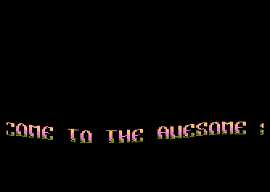
</a>

[https://gitlab.com/delysio/mad-pascal/-/tree/master/demoEffects/2x2%20sinus%20scroll](https://gitlab.com/delysio/mad-pascal/-/tree/master/demoEffects/2x2%20sinus%20scroll)

**Platform**  
Atari 8-bit

**Author**  
Daniel Koźmiński

 

---

## 31. Flob

<a href="images/31.png">
  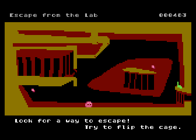
</a>

[https://gitlab.com/bocianu/flob](https://gitlab.com/bocianu/flob)

**Platform**  
Atari 8-bit

**Author**  
Wojciech Bociański

 

---

## 32. Ultima V

<a href="images/32.png">
  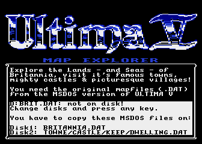
</a>

[https://atariage.com/forums/topic/319655-ultima-v-world-explorer-in-antic-mode-e/page/2/?tab=comments#comment-4903483](https://atariage.com/forums/topic/319655-ultima-v-world-explorer-in-antic-mode-e/page/2/?tab=comments#comment-4903483)

**Platform**  
Atari 8-bit

**Author**  
Atland Roland

 

---

## 33. mad-pascal-playground

[https://github.com/zbyti/mad-pascal-playground](https://github.com/zbyti/mad-pascal-playground)

**Platform**  
Atari 8-bit

**Author**  
Bartosz Zbytniewski 

---

## 34. simple-games-easy-for-develop

[https://github.com/zbyti/simple-games-easy-for-develop](https://github.com/zbyti/simple-games-easy-for-develop)

**Platform**  
Atari 8-bit

**Author**  
Bartosz Zbytniewski 

---

## 35. siege-ai-playground

<a href="images/35.png">
  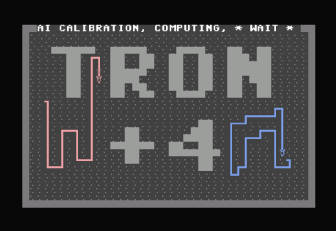
</a>

[https://github.com/zbyti/siege-ai-playground](https://github.com/zbyti/siege-ai-playground)

**Platform**  
Commodore Plus/4

**Author**  
Bartosz Zbytniewski  
Csabo  
Carrion 

---

## 36. Cartfall

<a href="images/36.png">
  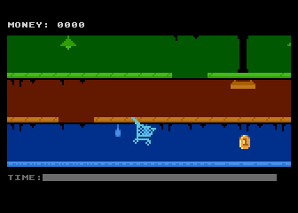
</a>

[https://gitlab.com/bocianu/cartfall](https://gitlab.com/bocianu/cartfall)

**Platform**  
Atari 8-bit

**Author**  
Wojciech Bociański

 

---

## 37. gravity

<a href="images/37.png">
  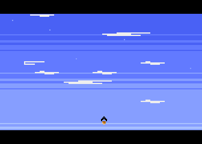
</a>

[https://gitlab.com/bocianu/gravity](https://gitlab.com/bocianu/gravity)

**Platform**  
Atari 8-bit

**Author**  
Wojciech Bociański

 

---

## 38. Unicode

> _This program has been created to check possibility of rendering unicode texts on Atari 8-bit computer._

<a href="images/38.png">
  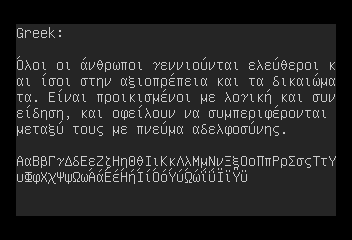
</a>

[https://gitlab.com/amarok8bit/unicode](https://gitlab.com/amarok8bit/unicode)

**Platform**  
Atari 8-bit

**Author**  
Krzysztof Piotrowski

 

---

## 39. Arcadia

<a href="images/39.png">
  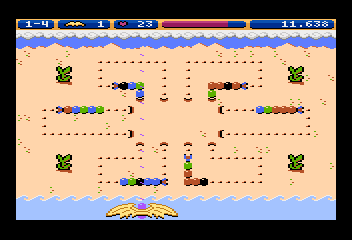
</a>

[https://gitlab.com/amarok8bit/arcadia](https://gitlab.com/amarok8bit/arcadia)

**Platform**  
Atari 8-bit

**Author**  
Krzysztof Piotrowski

 

---

## 40. atascii compo3

[https://gitlab.com/bocianu/atasciicompo3](https://gitlab.com/bocianu/atasciicompo3)

**Platform**  
Atari 8-bit

**Author**  
Wojciech Bociański 

---

## 41. ProHiBan

<a href="images/41.png">
  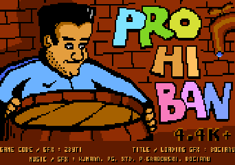
</a>

[https://github.com/zbyti/ProHiBan](https://github.com/zbyti/ProHiBan)

**Platform**  
Atari 8-bit

**Author**  
Bartosz Zbytniewski

 

---

## 42. The Hangmad

<a href="images/42.png">
  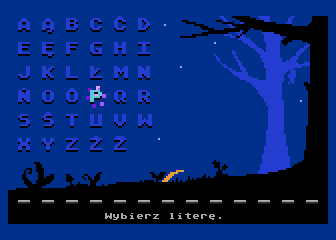
</a>

[https://gitlab.com/bocianu/thehangmad](https://gitlab.com/bocianu/thehangmad)

**Platform**  
Atari 8-bit

**Author**  
Wojciech Bociański

 

---

## 43. Block Attack

<a href="images/43.png">
  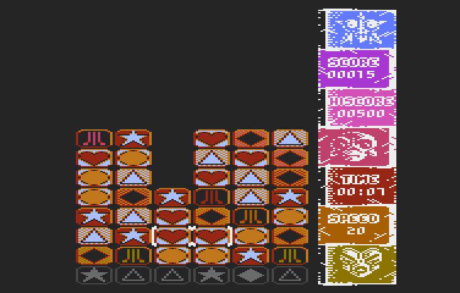
</a>

[https://github.com/tebe6502/Block-Attack](https://github.com/tebe6502/Block-Attack)

**Platform**  
Atari 8-bit

**Author**  
Tomasz Biela

 

---

## 44. Dungeon Adventurer

> _The idea for the game was taken from a similar production for the Amstrad CPC - Shadow Maze._

<a href="images/44.png">
  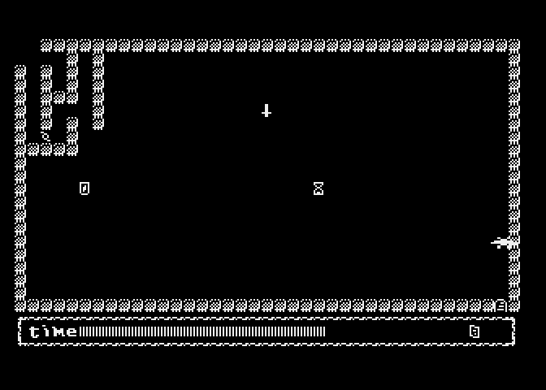
</a>

[https://gitlab.com/delysio/dungeon-adventurer/](https://gitlab.com/delysio/dungeon-adventurer/)

**Platform**  
Atari 8-bit

**Author**  
Daniel Koźmiński

 

---

## 45. neo-Tetris

> _Tetris game port for neo6502 microcomputer._

[https://gitlab.com/bocianu/neo-tetris](https://gitlab.com/bocianu/neo-tetris)

**Platform**  
neo6502

**Author**  
Wojciech Bociański 

---

## 46. neo-µSoukoban

<a href="images/46.png">
  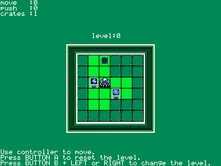
</a>

[https://github.com/zbyti/pikoban](https://github.com/zbyti/pikoban)

**Platform**  
neo6502

**Author**  
Bartosz Zbytniewski

 

---

## 47. Time Wizard

<a href="images/47.png">
  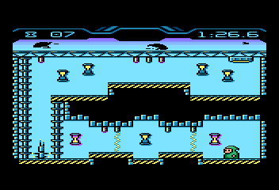
</a>

[https://gitlab.com/amarok8bit/time-wizard](https://gitlab.com/amarok8bit/time-wizard)

**Platform**  
Atari 8-bit

**Author**  
Krzysztof Piotrowski

 

---

## 48. run fox run

<a href="images/48.png">
  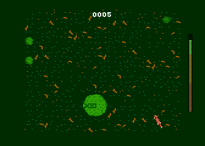
</a>

[https://gitlab.com/bocianu/run-fox-run](https://gitlab.com/bocianu/run-fox-run)

**Platform**  
Atari 8-bit

**Author**  
Wojciech Bociański 

---

## 49. Robots Rumble-VBXE

<a href="images/49.png">
  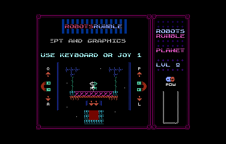
</a>

[https://github.com/tebe6502/robotsrumble](https://github.com/tebe6502/robotsrumble)

**Platform**  
Atari 8-bit

**Author**  
Tomasz Biela

 

---

## 50. neo-pas-template

> _This is a template for an empty project in the Mad-Pascal language for the Neo6502 computer. To learn how to compile your first project, check here._

[https://gitlab.com/bocianu/neo-pas-template](https://gitlab.com/bocianu/neo-pas-template)

**Platform**  
neo6502

**Author**  
Wojciech Bociański 

---

## 51. neo-sandbox

[https://gitlab.com/bocianu/neo-sandbox](https://gitlab.com/bocianu/neo-sandbox)

**Platform**  
neo6502

**Author**  
Wojciech Bociański 

---

## 52. neo-swimo

[https://gitlab.com/bocianu/neo-swimo](https://gitlab.com/bocianu/neo-swimo)

**Platform**  
neo6502

**Author**  
Wojciech Bociański 

---

## 53. neo-solsuite

[https://gitlab.com/bocianu/neo-solsuite](https://gitlab.com/bocianu/neo-solsuite)

**Platform**  
neo6502

**Author**  
Wojciech Bociański 

---

## 54. neo-bohomaze

> _A game inspired by the title "Outside" by Brokellusion. In each level, your goal is to collect the flashing key and find the exit, all while avoiding falling off the board._

[https://gitlab.com/bocianu/neo-bohomaze](https://gitlab.com/bocianu/neo-bohomaze)

**Platform**  
neo6502

**Author**  
Wojciech Bociański 

---

## 55. neo-mplib

> _A set of custom libraries for MadPascal that cover the range of API functions for the Neo6502, and a couple of auxiliary tools to make programming on the Neo6502 easier._

[https://gitlab.com/bocianu/neo-mplibs](https://gitlab.com/bocianu/neo-mplibs)

**Platform**  
neo6502

**Author**  
Wojciech Bociański 

---

## 56. Mafia

<a href="images/56.png">
  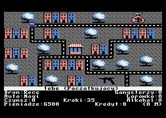
</a>

[https://github.com/drunkeneye/MAFIA.A8](https://github.com/drunkeneye/MAFIA.A8)

**Platform**  
Atari 8-bit

**Author**  
drunkeneye

 

---

## 57. PokeyMAX

[https://github.com/MADRAFi/PokeyMAX](https://github.com/MADRAFi/PokeyMAX)

**Platform**  
Atari 8-bit

**Author**  
Rafał Czemko 

---

## 58. PokeyMAX update tool

<a href="images/58.png">
  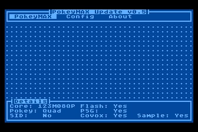
</a>

[https://github.com/MADRAFi/PMAX_Update](https://github.com/MADRAFi/PMAX_Update)

**Platform**  
Atari 8-bit

**Author**  
Rafał Czemko

 

---

## 59. rogul

<a href="images/59.png">
  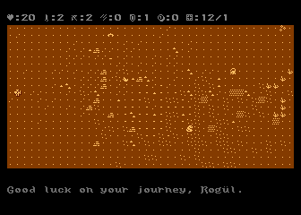
</a>

[https://gitlab.com/bocianu/rogul](https://gitlab.com/bocianu/rogul)

**Platform**  
Atari 8-bit

**Author**  
Wojciech Bociański

 

---

## 60. kara-t-rex

<a href="images/60.png">
  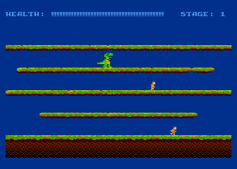
</a>

[https://gitlab.com/bocianu/kara-t-rex](https://gitlab.com/bocianu/kara-t-rex)

**Platform**  
Atari 8-bit

**Author**  
Wojciech Bociański

 

---

## 61. Minimum Spanning Tree

<a href="images/61.png">
  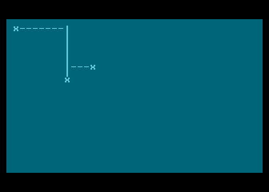
</a>

[https://github.com/mgr-inz-rafal/atari_msp_test](https://github.com/mgr-inz-rafal/atari_msp_test)

**Platform**  
Atari 8-bit

**Author**  
Rafał Chabowski

 

---

## 62. Piranhas

<a href="images/62.png">
  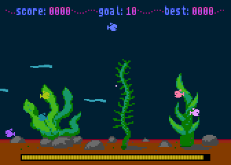
</a>

[https://gitlab.com/bocianu/3.14ranhas](https://gitlab.com/bocianu/3.14ranhas)

**Platform**  
Atari 8-bit

**Author**  
Wojciech Bociański

 

---

## 63. Nurek z wielkim...

<a href="images/63.png">
  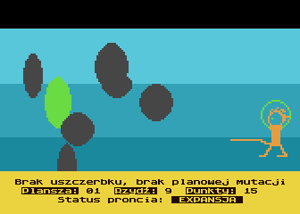
</a>

[https://github.com/mgr-inz-rafal/nurek_madp](https://github.com/mgr-inz-rafal/nurek_madp)

**Platform**  
Atari 8-bit

**Author**  
Rafał Chabowski

 

---

## 64. Cardiology

<a href="images/64.png">
  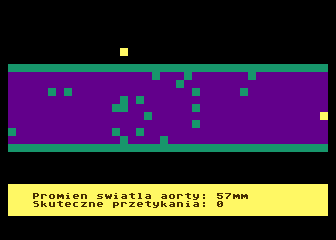
</a>

[https://github.com/mgr-inz-rafal/diagnostyka_serca](https://github.com/mgr-inz-rafal/diagnostyka_serca)

**Platform**  
Atari 8-bit

**Author**  
Rafał Chabowski

 

---

## 65. Tetris-VBXE

<a href="images/65.png">
  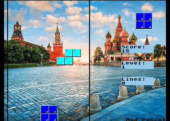
</a>

[https://github.com/tebe6502/Tetris-VBXE](https://github.com/tebe6502/Tetris-VBXE)

**Platform**  
Atari 8-bit

**Author**  
Tomasz Biela

 

---

## 66. Dither-Lab

> _Ditherlab is a tool for 8-bit Atari XL/XE computers equipped with at least 128 kB of RAM. It was created as part of the ABBUC Software Competition Applications 2026._

<a href="images/66.png">
  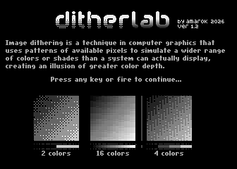
</a>

[https://gitlab.com/amarok8bit/dither-lab](https://gitlab.com/amarok8bit/dither-lab)

**Platform**  
Atari 8-bit

**Author**  
Krzysztof Piotrowski

 

---
