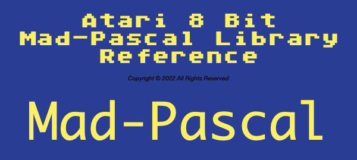

# A8 Mad-Pascal Window Library
Atari 8 Bit Text Mode Windowing Library written in Mad-Pascal.

This is a text mode windowing library complete with window controls and modern gadgets (widgets).  The gadgets allow you to build input forms that use buttons, radio buttons, input strings (with scrolled lengths and type restrictions), check boxes, progress bars, etc.  This allows you to build applications with "modern"-ish interfaces.  

The windowing system preserves the contents under a window, but is not z-order based (by design).  It is up to you to open and close windows in the correct order.  Complete sample programs are included, as well as full API documentation.

I originally wrote this in Action! language for the Atari 8 bit starting in 2015.  I added to it continually up through this year (2022).

I ran into some limitations with the Action! version in a project regarding memory space and function paramater size when compiled into a standlone executable.  This prompted the conversion into C.   I considered several C implementations on the Atari 8 bit itself, then settled on CC65 to use modern development tools and target the A8 platform.

Once the libraries were published and announced, Amarok on AtariAge kindly converted the C version source files of the library to Mad-Pascal.  Subsequently I created an API document to match the others for the Mad-Pascal version.  The Mad-Pascal version would not be here if it were not for Amarok!  Thank you Amarok for the conversion!

License: GNU General Public License v3.0

See the LICENSE file for full license information.
